<div align="center">

# 🎬 MovieApp

### A production-grade Android movie app — Multi-Module **Clean Architecture**, **MVI**, **Jetpack Compose** & **Navigation 3**

Browse popular / now-playing / top-rated / upcoming movies from **TMDB**, search the catalogue, build a favourites watchlist, and read rich details — fully **offline-first**, **localized (EN/AR + RTL)**, and **theme-aware (Light/Dark/Dynamic)**.

<br/>


</div>

---

## 📑 Table of contents

1. [Screenshots](#-screenshots)
2. [Features](#-features)
3. [Tech stack](#-tech-stack)
4. [Architecture (drawn)](#-architecture)
   - [Clean Architecture layers](#clean-architecture-layers)
   - [Module dependency graph](#module-dependency-graph)
   - [MVI · unidirectional data flow](#mvi--unidirectional-data-flow)
   - [Offline-first data flow](#offline-first-data-flow)
   - [Navigation 3 wiring](#navigation-3-wiring)
5. [SOLID principles in practice](#-solid-principles-in-practice)
6. [Module breakdown](#-module-breakdown)
7. [Strict dependency rules](#-strict-dependency-rules)
8. [Getting started (TMDB key + run)](#-getting-started)
9. [Testing](#-testing)
10. [Project structure](#-project-structure)

---

## 📸 Screenshots

### Onboarding

<div align="center">
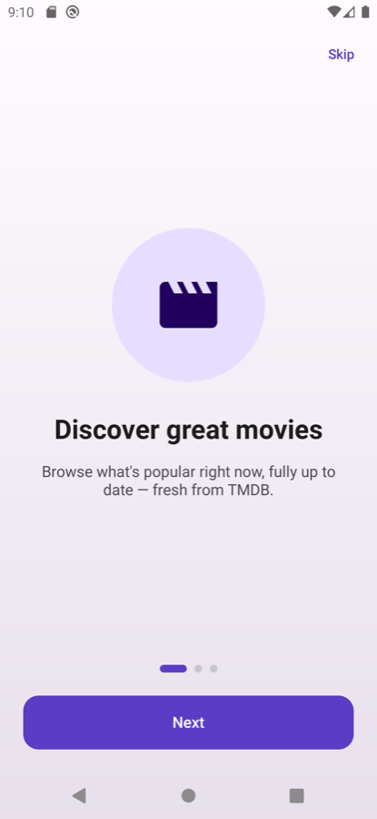
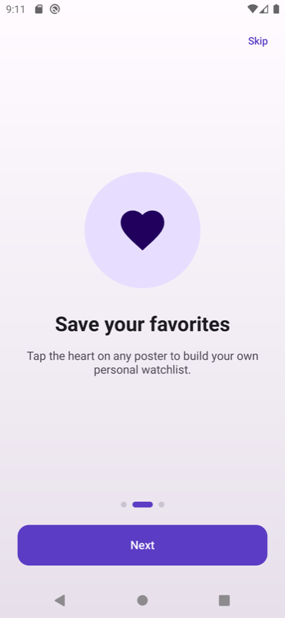
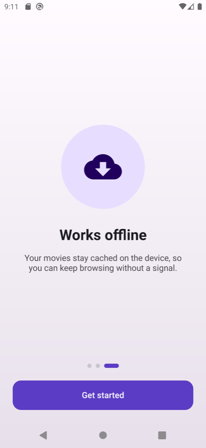
</div>

### Home · Categories · Details

<div align="center">
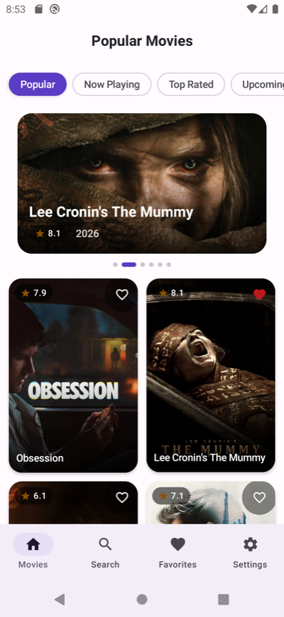
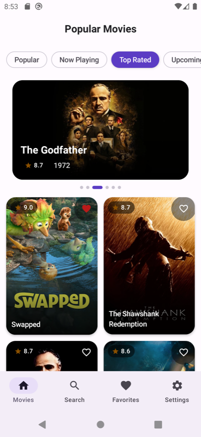
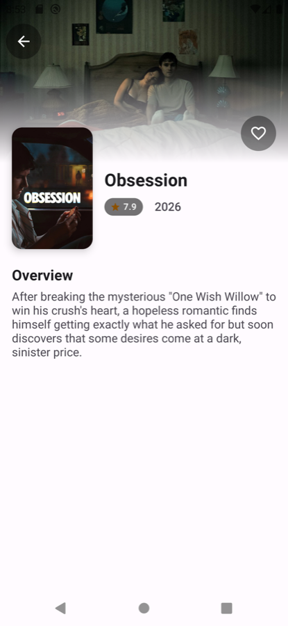
</div>

### Search · Favourites · Settings

<div align="center">
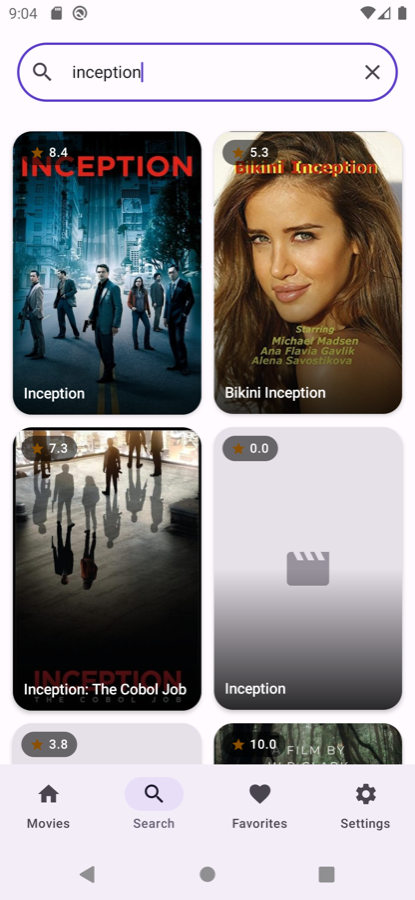
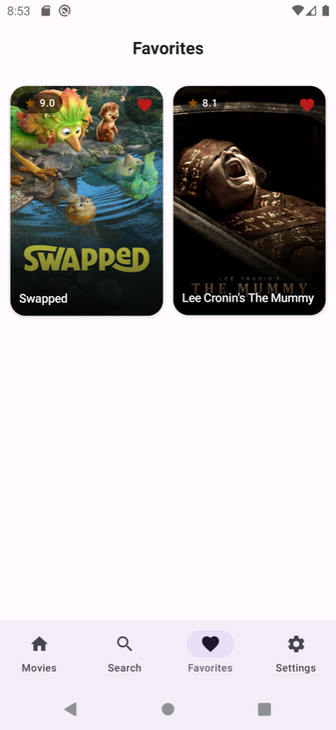
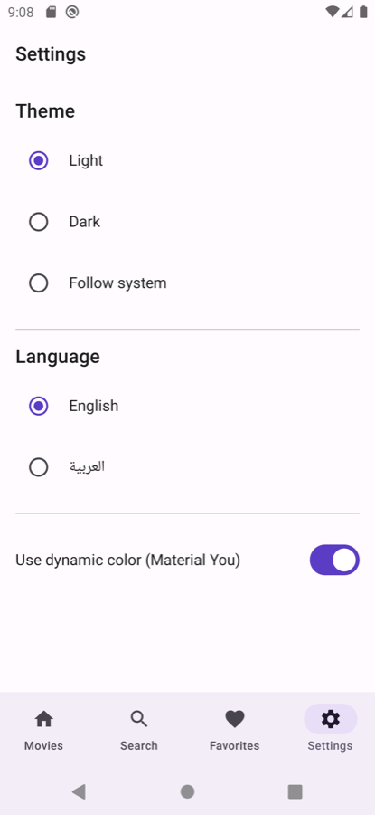
</div>

### Dark theme

<div align="center">
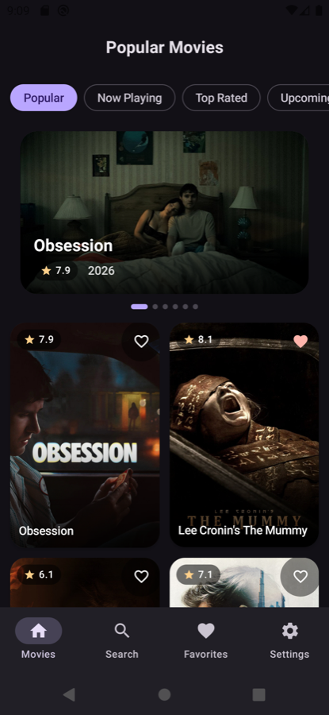
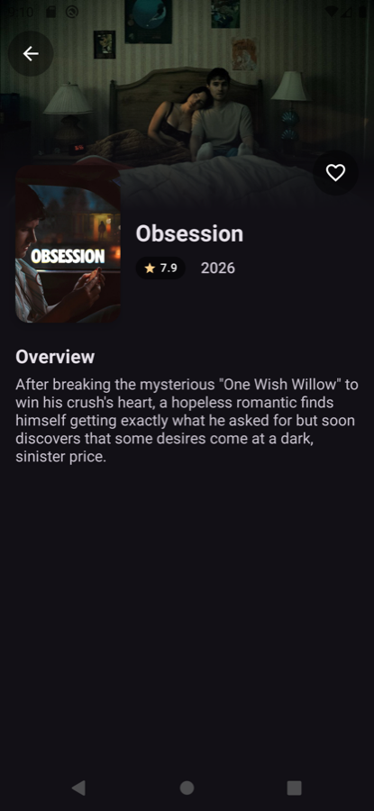
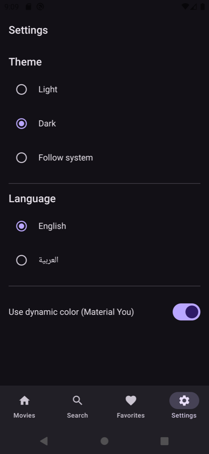
</div>

---

## ✨ Features

| | Feature | Notes |
|---|---|---|
| 🎞️ | **Browse 4 TMDB lists** | Popular · Now Playing · Top Rated · Upcoming, via scrollable category tabs |
| 🌟 | **Featured hero carousel** | Auto-advancing backdrop pager with parallax depth |
| ♾️ | **Infinite paging** | Paging 3 + `RemoteMediator`, write-through to Room |
| 📴 | **Offline-first** | Room is the single source of truth; the network only refills the cache |
| 🔎 | **Debounced search** | 350 ms debounce, poster-rich result grid |
| ❤️ | **Favourites** | Optimistic local writes; animated heart that pops on toggle |
| 🖼️ | **Rich details** | Immersive edge-to-edge backdrop, overlapping poster, overview, favourite |
| 🎬 | **Shared-element transition** | The tapped poster **morphs** into the details screen |
| 🪄 | **Motion everywhere** | Slide/fade screen transitions, crossfades, shimmer loading, item animations |
| 🌗 | **Theming** | Light / Dark / Follow-system + Material You dynamic color |
| 🌍 | **Localization** | English & Arabic with full **RTL** mirroring |
| 🧭 | **First-run onboarding** | Plus a guided in-app **API-key setup** screen |
| 🔄 | **Background sync** | Periodic, connectivity-constrained refresh via WorkManager |
| 🧪 | **Tested** | Pure reducers, use cases, mappers & `Outcome` covered by unit tests |

---

## 🧰 Tech stack

| Area | Library | Version |
|---|---|---|
| **Language** | Kotlin (Coroutines `1.11`, Flow) | `2.3.21` |
| **UI** | Jetpack Compose (BOM) · Material 3 | BOM `2026.05.01` · M3 `1.4.0` |
| **Icons** | Material Icons Extended | `1.7.8` |
| **Navigation** | **Navigation 3** (`navigation3` + viewmodel-nav3) | `1.1.2` |
| **DI** | Koin (+ Compose, WorkManager, Test) | `4.2.1` |
| **Networking** | Ktor Client (OkHttp engine, ContentNegotiation, Auth, Logging) | `3.5.0` |
| **Serialization** | kotlinx.serialization JSON | `1.11.0` |
| **Local DB** | Room (KSP) | `2.8.4` |
| **Paging** | Paging 3 (runtime, compose, RemoteMediator) | `3.5.0` |
| **Preferences** | DataStore (Preferences) | `1.2.1` |
| **Images** | Coil 3 (+ OkHttp network) | `3.4.0` |
| **Background** | WorkManager | `2.11.2` |
| **Build** | AGP · KSP · Gradle **convention plugins** | AGP `9.0.1` · KSP `2.3.7` |
| **Testing** | JUnit4 · Turbine · MockK · coroutines-test | `4.13.2` / `1.2.1` / `1.14.11` |

> Versions are centralized in a **Gradle Version Catalog** (`gradle/libs.versions.toml`), and cross-cutting build config lives in **`build-logic`** convention plugins (`movieapp.android.library`, `movieapp.android.compose`, `movieapp.koin`, …) so every module keeps a tiny build file.

---

## 🏛 Architecture

The app is **Clean Architecture**, sliced into **23 Gradle modules** across three rings — `core` (infrastructure) → `common` (layer-shared) → `feature` (verticals) — assembled by `:app`. Every feature is split into **`domain` / `data` / `presentation`** and is **completely isolated** from every other feature; cross-feature collaboration happens only through **contracts** in `core:contract`.

### Clean Architecture layers

> Dependencies point **inward**. The domain (pure Kotlin) knows nothing about Android, Compose, Room, or Ktor.

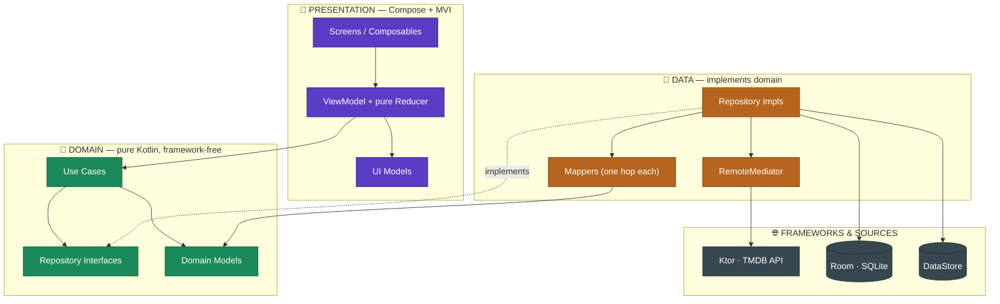

### Module dependency graph

> A feature's `presentation` never sees `data`; an `:app`-level wiring binds implementations to contracts. No `feature → feature` edge exists anywhere.

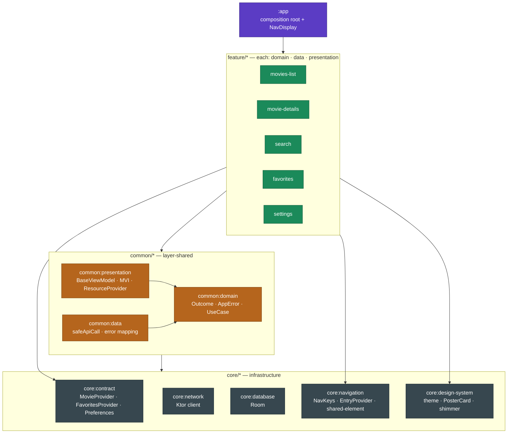

### MVI · unidirectional data flow

> State is the single source of truth. The UI only sends **Intents**; the **pure Reducer** computes the next **State**; one-shot **Effects** (navigation, snackbars) are never part of state.

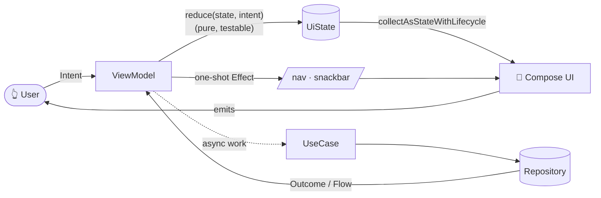

### Offline-first data flow

> The UI **always** reads from Room. The network is a background detail that **refills the cache** — failures are soft (cached data stays on screen).

```mermaid
sequenceDiagram
    participant UI as Compose UI
    participant P as Paging 3
    participant Room as Room (SoT)
    participant M as RemoteMediator
    participant API as Ktor → TMDB

    UI->>P: collect pagedMovies(category)
    P->>Room: pagingSource(category)
    Room-->>UI: cached pages ⚡ (instant, even offline)
    P->>M: load(REFRESH / APPEND)
    M->>API: GET movie/{category}?page=n  (Bearer token)
    API-->>M: MoviesPageDto
    M->>Room: upsert (write-through, per-category keys)
    Room-->>UI: re-emits updated pages
    Note over M,UI: On error → MediatorResult.Error(typed AppError)<br/>cache stays intact; UI shows a precise message
```

### Navigation 3 wiring

> One `NavDisplay` and one back stack live in `:app`. Each feature contributes a `FeatureEntryProvider` (collected from Koin via `getAll()`), so a feature pushes another feature's screen using a **typed `NavKey`** — without importing it.

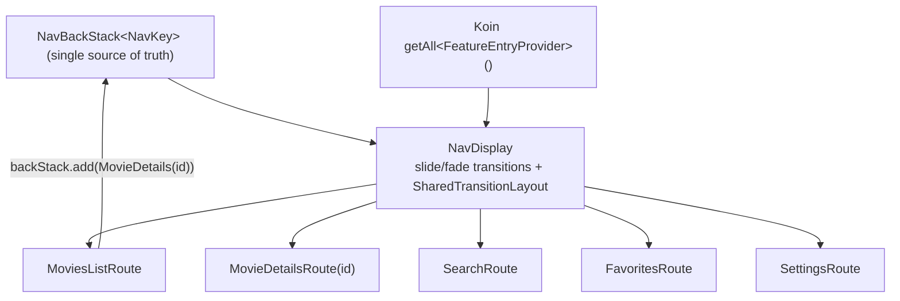

---

## 🧱 SOLID principles in practice

| Principle | How MovieApp applies it |
|---|---|
| **S — Single Responsibility** | Every type has one job: a **Reducer** only computes state (no I/O), a **Mapper** does exactly one hop (`Dto→Entity→Domain→Summary`), a **UseCase** performs one action, and `safeApiCall` is the *only* place exceptions become typed `AppError`s. |
| **O — Open/Closed** | New features extend the app **without modifying** it: each contributes a `FeatureEntryProvider` that `:app` discovers via `Koin.getAll()`. Adding a movie list (e.g. *Trending*) is just a new `MovieCategory` enum case — the paging/cache pipeline is untouched. |
| **L — Liskov Substitution** | Code depends on abstractions any implementation can satisfy: `MoviesRepository`, `MovieProvider`, `FavoritesProvider`, `UserPreferencesRepository`. Tests swap real impls for fakes/mocks with zero call-site changes. |
| **I — Interface Segregation** | Contracts are tiny and client-specific. `FavoritesProvider` exposes only `observeFavoriteIds()` + `toggleFavorite()`; `MovieProvider` only what details/favourites need — no fat “god” interface. |
| **D — Dependency Inversion** | High-level policy (domain/presentation) depends on **interfaces**; low-level details (Room, Ktor) implement them and are wired at the edge by **Koin**. `feature:movie-details` consumes `MovieProvider` while `feature:movies-list` provides it — they never touch each other. |

This is enforced *structurally* by the Gradle module graph + `build-logic` convention plugins, not just by convention — an illegal `feature → feature` dependency simply won't compile.

---

## 🗂 Module breakdown

### `core/*` — infrastructure (innermost)
| Module | Responsibility |
|---|---|
| `core:contract` | Cross-feature **interfaces & DTOs** (`MovieProvider`, `FavoritesProvider`, `UserPreferencesRepository`, `MovieSummary`). The only way features talk. |
| `core:network` | Ktor `HttpClient` (OkHttp), TMDB bearer auth, timeouts/retries, Logcat logging, `BuildConfig` secrets. |
| `core:database` | Room database, entities (`MovieEntity`, `FavoriteMovieEntity`, remote keys), DAOs, per-category cache keys. |
| `core:navigation` | Typed `NavKey`s, `FeatureEntryProvider`, and the **shared-element** helper (`sharedMovieElement`, `LocalSharedTransitionScope`). |
| `core:design-system` | Material 3 theme (light/dark/dynamic), spacing/typography tokens, reusable components (`PosterCard`, `PosterImage`, shimmer, `RatingBadge`, state views). |

### `common/*` — layer-shared (above core, below features)
| Module | Responsibility |
|---|---|
| `common:domain` | `Outcome<T>`, the typed `AppError` vocabulary, `UseCase`/`FlowUseCase` base types. |
| `common:data` | `safeApiCall`/`safeDbCall`, `Throwable → AppError` mapping. |
| `common:presentation` | `BaseViewModel`, MVI markers (`UiState`/`Intent`/`Effect`/`Reducer`), `ResourceProvider`, error-to-string mappers, formatters. |

### `feature/*` — verticals (each = `domain` + `data` + `presentation`)
`movies-list` · `movie-details` · `search` · `favorites` · `settings`

### `:app` — composition root
Single Activity, single `NavDisplay`, Koin start-up, WorkManager scheduling, onboarding & API-key gates. **Binds every implementation to its contract here — and only here.**

---

## 🔒 Strict dependency rules

1. **No `feature → feature`, ever.** Features collaborate only through `core:contract`.
2. **Layer-matched access.** `presentation → common:presentation`, `data → common:data`, `domain → common:domain`. A presentation module *cannot* see `data`/`network`/`database`.
3. **One-way direction.** `app → feature → common → core`. Never the reverse.

```
:app  ─►  feature/*  ─►  common/*  ─►  core/*
                  └─►  core:contract  ◄─┘   (features meet here, not directly)
```

---

## 🚀 Getting started

### 1. Get a free TMDB key
1. Create an account at **[themoviedb.org](https://www.themoviedb.org/)** → **Settings → API**.
2. Copy the **API Read Access Token** (the long v4 *Bearer* token).

### 2. Add it to `local.properties` (git-ignored)
```properties
TMDB_ACCESS_TOKEN=eyJhbGciOi...your token...
TMDB_BASE_URL=https://api.themoviedb.org/3/
TMDB_IMAGE_BASE_URL=https://image.tmdb.org/t/p/
```
> The token is surfaced through `BuildConfig` and **never committed**. If it's missing, the app shows a friendly **in-app setup screen** that walks you through these steps (and you can still “Continue anyway”).

### 3. Build & run
```bash
# assemble + install the debug app on a connected device/emulator
./gradlew :app:installDebug

# …or just open the project in Android Studio and press Run ▶
```

**Requirements:** Android Studio (latest stable), JDK 17, an emulator/device on **API 24+**.

---

## 🧪 Testing

```bash
./gradlew testDebugUnitTest      # all unit tests
```

Covered with fast, deterministic tests (JUnit4 + Turbine + MockK + coroutines-test):

- **Reducers** — every feature's pure state transitions (`MoviesList`, `MovieDetails`, `Search`, `Favorites`, `Settings`).
- **Use cases** — e.g. the search blank-query short-circuit.
- **Mappers** — `Dto → Entity → Domain → Summary` chains, URL building, null handling.
- **Core types** — `Outcome` result helpers.

> Pure reducers/use-cases make business logic testable **without** Android, Compose, or a device.

---

## 📁 Project structure

```
MovieApp/
├─ app/                       # composition root: Activity, NavDisplay, DI start-up, gates
├─ build-logic/convention/    # Gradle convention plugins (android.library, compose, koin, room…)
├─ core/
│  ├─ contract/               # cross-feature interfaces + MovieSummary
│  ├─ network/                # Ktor client + TMDB config
│  ├─ database/               # Room (entities, DAOs, category-keyed cache)
│  ├─ navigation/             # NavKeys, FeatureEntryProvider, shared-element helper
│  └─ design-system/          # theme, tokens, PosterCard, shimmer, state views
├─ common/
│  ├─ domain/                 # Outcome, AppError, UseCase bases
│  ├─ data/                   # safeApiCall, error mapping
│  └─ presentation/           # BaseViewModel, MVI, ResourceProvider, formatters
├─ feature/
│  ├─ movies-list/            # domain · data · presentation  (categories, paging, hero)
│  ├─ movie-details/          # domain · presentation         (rich details + favourite)
│  ├─ search/                 # domain · data · presentation
│  ├─ favorites/              # domain · data · presentation
│  └─ settings/               # domain · data · presentation  (theme/lang/dynamic color)
├─ gradle/libs.versions.toml  # version catalog (single source of versions)
└─ docs/screenshots/          # the images in this README
```

---

<div align="center">

Built with ❤️ on **Clean Architecture**, **MVI** and **Jetpack Compose**.

Movie data & images courtesy of **[The Movie Database (TMDB)](https://www.themoviedb.org/)** — this product uses the TMDB API but is not endorsed or certified by TMDB.

<br/>

⭐ *If this architecture reference helped you, give it a star.*

</div>
